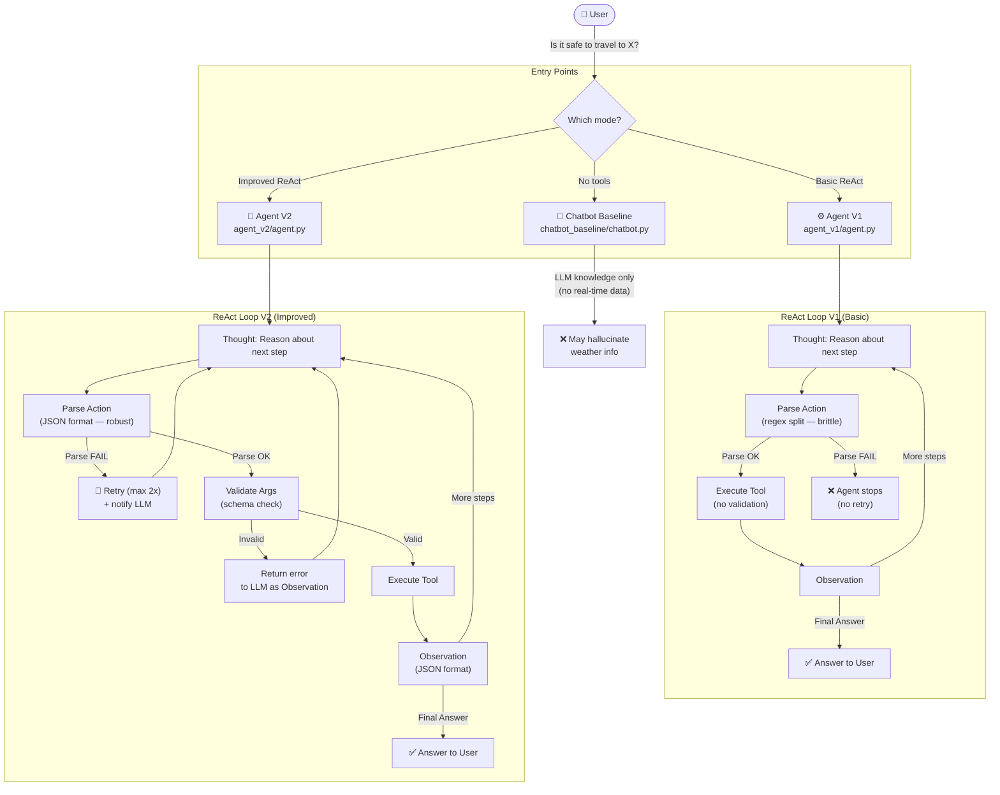
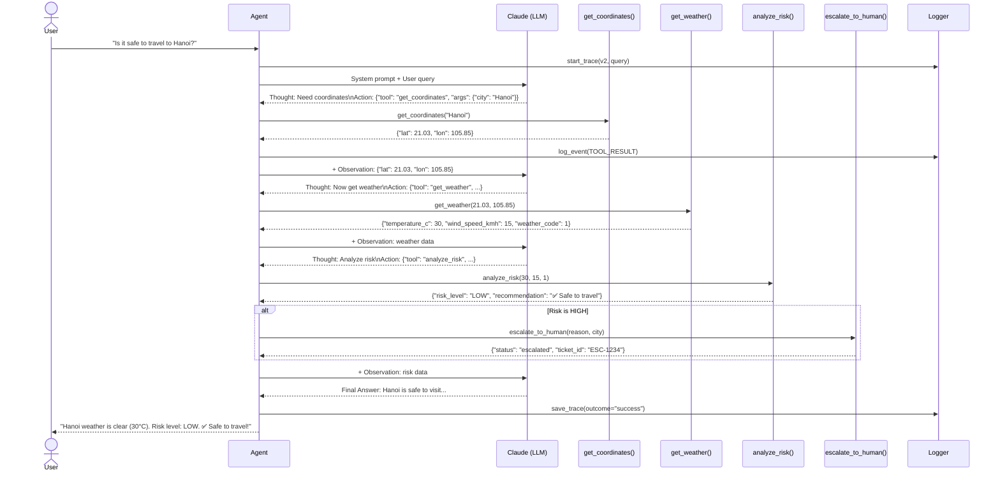
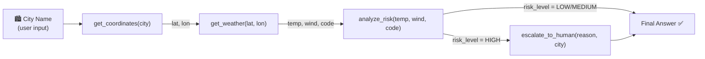
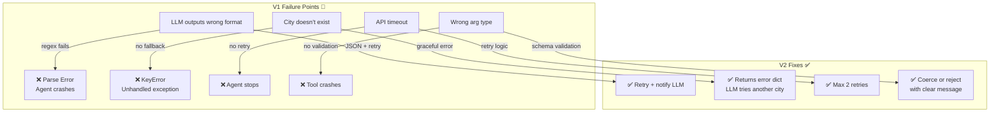

# Flowchart — Smart Weather Planner ReAct Agent

## 1. Tổng quan kiến trúc hệ thống

```mermaid
graph TB
    User([👤 User]) -->|"Is it safe to travel to X?"| Router

    subgraph "Entry Points"
        Router{Which mode?}
        Router -->|No tools| Chatbot["🤖 Chatbot Baseline\nchatbot_baseline/chatbot.py"]
        Router -->|Basic ReAct| AgentV1["⚙️ Agent V1\nagent_v1/agent.py"]
        Router -->|Improved ReAct| AgentV2["🚀 Agent V2\nagent_v2/agent.py"]
    end

    Chatbot -->|"LLM knowledge only\n(no real-time data)"| ChatbotOut["❌ May hallucinate\nweather info"]
    AgentV1 --> ReactV1
    AgentV2 --> ReactV2

    subgraph "ReAct Loop V1 (Basic)"
        ReactV1["Thought: Reason about next step"]
        ReactV1 --> ParseV1["Parse Action\n(regex split — brittle)"]
        ParseV1 -->|"Parse OK"| ToolsV1
        ParseV1 -->|"Parse FAIL"| ErrV1["❌ Agent stops\n(no retry)"]
        ToolsV1["Execute Tool\n(no validation)"] --> ObsV1["Observation"]
        ObsV1 -->|"More steps"| ReactV1
        ObsV1 -->|"Final Answer"| OutV1["✅ Answer to User"]
    end

    subgraph "ReAct Loop V2 (Improved)"
        ReactV2["Thought: Reason about next step"]
        ReactV2 --> ParseV2["Parse Action\n(JSON format — robust)"]
        ParseV2 -->|"Parse FAIL"| RetryV2["🔁 Retry (max 2x)\n+ notify LLM"]
        RetryV2 --> ReactV2
        ParseV2 -->|"Parse OK"| ValidateV2["Validate Args\n(schema check)"]
        ValidateV2 -->|"Invalid"| FeedbackV2["Return error\nto LLM as Observation"]
        FeedbackV2 --> ReactV2
        ValidateV2 -->|"Valid"| ToolsV2["Execute Tool"]
        ToolsV2 --> ObsV2["Observation\n(JSON format)"]
        ObsV2 -->|"More steps"| ReactV2
        ObsV2 -->|"Final Answer"| OutV2["✅ Answer to User"]
    end
```

---

## 2. Chi tiết ReAct Loop

```mermaid
sequenceDiagram
    actor User
    participant Agent
    participant LLM as Claude (LLM)
    participant GeoTool as get_coordinates()
    participant WxTool as get_weather()
    participant RiskTool as analyze_risk()
    participant EscTool as escalate_to_human()
    participant Logger

    User->>Agent: "Is it safe to travel to Hanoi?"
    Agent->>Logger: start_trace(v2, query)

    Agent->>LLM: System prompt + User query
    LLM-->>Agent: Thought: Need coordinates\nAction: {"tool": "get_coordinates", "args": {"city": "Hanoi"}}

    Agent->>GeoTool: get_coordinates("Hanoi")
    GeoTool-->>Agent: {"lat": 21.03, "lon": 105.85}
    Agent->>Logger: log_event(TOOL_RESULT)

    Agent->>LLM: + Observation: {"lat": 21.03, "lon": 105.85}
    LLM-->>Agent: Thought: Now get weather\nAction: {"tool": "get_weather", ...}

    Agent->>WxTool: get_weather(21.03, 105.85)
    WxTool-->>Agent: {"temperature_c": 30, "wind_speed_kmh": 15, "weather_code": 1}

    Agent->>LLM: + Observation: weather data
    LLM-->>Agent: Thought: Analyze risk\nAction: {"tool": "analyze_risk", ...}

    Agent->>RiskTool: analyze_risk(30, 15, 1)
    RiskTool-->>Agent: {"risk_level": "LOW", "recommendation": "✅ Safe to travel"}

    alt Risk is HIGH
        Agent->>EscTool: escalate_to_human(reason, city)
        EscTool-->>Agent: {"status": "escalated", "ticket_id": "ESC-1234"}
    end

    Agent->>LLM: + Observation: risk data
    LLM-->>Agent: Final Answer: Hanoi is safe to visit...

    Agent->>Logger: save_trace(outcome="success")
    Agent-->>User: "Hanoi weather is clear (30°C). Risk level: LOW. ✅ Safe to travel!"
```

---

## 3. Tool Dependency Flow

```mermaid
graph LR
    City["🏙️ City Name\n(user input)"] --> GEO["get_coordinates(city)"]
    GEO -->|lat, lon| WX["get_weather(lat, lon)"]
    WX -->|temp, wind, code| RISK["analyze_risk(temp, wind, code)"]
    RISK -->|risk_level = HIGH| ESC["escalate_to_human(reason, city)"]
    RISK -->|risk_level = LOW/MEDIUM| ANS["Final Answer ✅"]
    ESC --> ANS
```

---

## 4. V1 vs V2 Failure Points

```mermaid
graph TD
    subgraph "V1 Failure Points 🔴"
        A1["LLM outputs wrong format"] -->|regex fails| F1["❌ Parse Error\nAgent crashes"]
        A2["City doesn't exist"] -->|no fallback| F2["❌ KeyError\nUnhandled exception"]
        A3["API timeout"] -->|no retry| F3["❌ Agent stops"]
        A4["Wrong arg type"] -->|no validation| F4["❌ Tool crashes"]
    end

    subgraph "V2 Fixes ✅"
        A1 -->|JSON + retry| G1["✅ Retry + notify LLM"]
        A2 -->|graceful error| G2["✅ Returns error dict\nLLM tries another city"]
        A3 -->|retry logic| G3["✅ Max 2 retries"]
        A4 -->|schema validation| G4["✅ Coerce or reject\nwith clear message"]
    end
```
